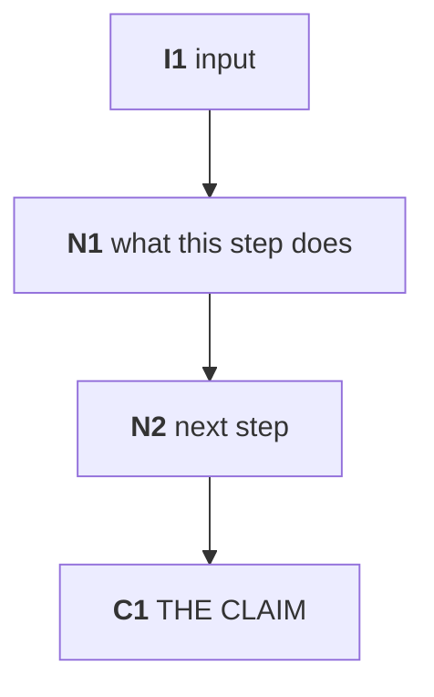

# Discovery DAG — iteration {{N}}

**Created {{DATE}}.** The object under verification is not a number, it is a
**path**. A result can be *reproduced* by re-running the same path; it can only
be *verified* by seeing which edges carry it.

> **This document is the only place where the iteration's code may be read.**
> It reconstructs what was done so that a re-implementation can be written from
> this specification and never from `scripts/`. Once frozen, it is the sole
> input handed to replication agents — that firewall is the whole point, because
> an agent that reads the original code reproduces its choices, including its
> mistakes, and agreement then proves only that both parties read the same file.

Drawing the graph before writing any replication code also fixes the
**denominator problem**: you cannot count how many tests a result survived until
you can see how many branches the graph has.

## 1. Inputs

Every input the path consumes, with the checksum or accession that identifies it.

| id | what | identity (hash / accession / version) |
|---|---|---|
| I1 |  |  |

## 2. The graph, as it ran

## 3. Nodes

One row per node. **Decision** means a choice was made that could have gone
another way — those are the edges a replication will disagree on.

| id | operation | parameters / thresholds | decision? | output |
|---|---|---|---|---|
| N1 |  |  | no |  |

## 4. Branch count

<how many distinct paths exist from inputs to claim, and how many were actually
reported. The gap between those two numbers is the multiple-testing denominator
that no report ever states.>

## 5. What falls out of the graph

<structural findings visible in the topology and in no report: nodes with no
incoming edge, steps that failed and were never noticed, two nodes that the
argument treats as connected with no edge between them, a filter upstream of the
node it was supposed to protect.>

## 6. Terminal claim

<the exact sentence the path produces, with its number. This is what a
replication must reproduce, and what it must reproduce it *as* — membership, not
counts, wherever the object is a set.>
